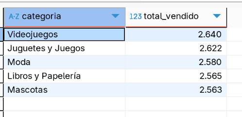

OS: Linux
## Pasos para configurar entorno.

- Instalar Postgresql desde Pacman.
- Inicializar DB (just first time):
. sudo -iu postgres
. initdb -D /var/lib/postgres/data
. exit
- Arrancar Servicio
. sudo systemctl start postgresql
. sudo systemctl enable postgresql
- sudo -iu postgres
- createuser --interactive  #(poné el nombre de tu usuario de sistema, y elegí que pueda crear DB)
- createdb test_db
- psql -c "ALTER USER tu_usuario PASSWORD 'tu_password';"
- exit

- Test Postgresql
. psql -U tu_usuario -d test_db

- Instalar y configurar Dbeaver > postgres 
. sudo pacman -S dbeaver
. dbeaver &
. conectar a DB > postgres > completar con los datos de usuario (account & pass) y db.

## Desde Python
- armar venv
. python -m venv venv
- Instalar ORM
. pip install sqlalchemy psycopg2
/ psycopg2: Driver para conectar a PostgreSQL (Es el “puente” real entre SQLAlchemy y la base de datos)
/ sqlalchemy: ORM para interactuar con la base de datos de forma más declarativa
. pip install dbt-postgres

- Para activar y desactivar el venv:
. source venv/bin/activate
. deactivates

## Descargar Archivos CSV
. https://drive.google.com/drive/folders/1YIwI_sNIZBHwYkgpGPeJx3utnci8NCqc

## Estructura
- Project: Directorio principal del proyecto.
- tests: Directorio para realizar tests como conectarme a Pgres.
- data/CSV: Directorio junto con las fuentes de datos (csv).
- posgres: Directorio utilizado para crear modelos, cargar info, explorar y crear subcategoria.
- ecommerce: Directorio con el proyecto DBT. (es necesario configura tanto profile.yml como project.yml)
- images: Directorio con capturas de distintos avances del PI2.

## Limpieza y normalizacion de ficheros csv
- se corre el siguiente codigo name_norm_csv.py dentro de aux.

## Creacion de Modelos y Carga de Datos
- Se ejecutan models.py & load.py 

## Exploracion (semiestructurados)
- Existe una sola tabla y campo con datos semi-estructurados categorias.csv > "descripcion".
- Se procede a crear la tabla subcategorias (se prodia splitear por "," u "y", pero las subcategorias pierden
sentido para ciertos registros).
- Se ejecuta sub_category.py

## Exploratorio SQL 
- Tablas vacias
```
SELECT COUNT(*) FROM usuarios;
SELECT COUNT(*) FROM categorias;
SELECT COUNT(*) FROM productos;
SELECT COUNT(*) FROM ordenes;
SELECT COUNT(*) FROM detalle_ordenes;
SELECT COUNT(*) FROM direcciones_envio;
SELECT COUNT(*) FROM carrito;
SELECT COUNT(*) FROM metodos_pago;
SELECT COUNT(*) FROM ordenes_metodopago;
SELECT COUNT(*) FROM resenas_productos;
SELECT COUNT(*) FROM historial_pagos;
SELECT COUNT(*) FROM subcategorias;
```

- Todas las tablas contienen datos excepto "metodos_pago", la cual se encuentra completamente vacia.

- Campos Nulos
```
ejemplo base: 
SELECT
  COUNT(*) AS total,
  COUNT(*) - COUNT(nombre) AS nombre_nulos,
  COUNT(*) - COUNT(apellido) AS apellido_nulos,
  COUNT(*) - COUNT(dni) AS dni_nulos,
  COUNT(*) - COUNT(email) AS email_nulos,
  COUNT(*) - COUNT(contrasena) AS contraseña_nulos
FROM usuarios
```
```
Esta misma regla la aplique para cada una de las tablas, encontrando los siguientes campos vacios:
Usuarios: completo
Categorias: completo
Productos: completo
Ordenes: completo
Detalle_ordenes: completo
Direcciones_envio: completo
Carrito: completo
Ordenes Metodopago: completo
Reseñas Productos: completo
Historial Pagos: completo
Subcategorias: completo
```
## Exploratorio ORM
Para el resto de la exploracion desde ORM, decidi armar algunos scripts automatizados que me devolvieran los resultados en .txt.
- exploration.py
### duplicados_usuarios: 
Total filas en usuarios: 1000
Duplicados por DNI (0 filas):
No se encontraron duplicados por DNI.
Duplicados por Email (0 filas):
No se encontraron duplicados por Email.

### reporte nulos: 
--- Tabla: usuarios ---
Total filas: 1000
Nulos por columna:
  id: 0
  nombre: 0
  apellido: 0
  dni: 0
  email: 0
  contrasena: 0

--- Tabla: carrito ---
Total filas: 5000
Nulos por columna:
  id: 0
  usuario_id: 0
  producto_id: 0
  cantidad: 0
  fecha_agregado: 0

--- Tabla: detalle_ordenes ---
Total filas: 10000
Nulos por columna:
  id: 0
  orden_id: 0
  producto_id: 0
  cantidad: 0
  precio_unitario: 0

--- Tabla: direcciones_envio ---
Total filas: 1000
Nulos por columna:
  id: 0
  usuario_id: 0
  calle: 0
  ciudad: 0
  departamento: 0
  provincia: 0
  distrito: 0
  estado: 0
  codigo_postal: 0
  pais: 0

--- Tabla: historial_pagos ---
Total filas: 10000
Nulos por columna:
  id: 0
  orden_id: 0
  metodo_pago_id: 0
  monto: 0
  fecha_pago: 0
  estado_pago: 0

--- Tabla: metodos_pago ---
Total filas: 0
Nulos por columna:
  id: 0
  nombre: 0
  descripcion: 0

--- Tabla: ordenes ---
Total filas: 10000
Nulos por columna:
  id: 0
  usuario_id: 0
  fecha_orden: 0
  total: 0
  estado: 0

--- Tabla: ordenes_metodopago ---
Total filas: 10000
Nulos por columna:
  id: 0
  orden_id: 0
  metodo_pago_id: 0
  monto_pagado: 0

--- Tabla: productos ---
Total filas: 36
Nulos por columna:
  id: 0
  nombre: 0
  descripcion: 0
  precio: 0
  stock: 0
  categoria_id: 0

--- Tabla: resenas_productos ---
Total filas: 7172
Nulos por columna:
  id: 0
  usuario_id: 0
  producto_id: 0
  calificacion: 0
  comentario: 0
  fecha: 0

--- Tabla: subcategorias ---
Total filas: 41
Nulos por columna:
  id: 0
  nombre: 0
  categoria_id: 0


### valores atipicos productos: 
 --Se prodria investigar valores atipicos, de mi lado en el explo, no encontre algo util..


## RESPUESTAS PARA EL NEGOCIO #1

- ¿Cuáles son los productos más vendidos por volumen?
```
SELECT  
    p.nombre AS producto, 
    SUM(d.cantidad) AS total_vendido
FROM detalle_ordenes d
JOIN productos p ON d.producto_id = p.id
GROUP BY p.nombre
ORDER BY total_vendido DESC
LIMIT 5
```


- ¿Cuál es el ticket promedio por orden?
```
SELECT AVG(total) AS ticket_promedio
FROM ordenes
```


- ¿Cuáles son las categorías con mayor número de productos vendidos?
```
SELECT 
    c.nombre AS categoria,
    SUM(d.cantidad) AS total_vendido
FROM detalle_ordenes d
JOIN productos p ON d.producto_id = p.id
JOIN categorias c ON p.categoria_id = c.id
GROUP BY c.nombre
ORDER BY total_vendido desc
limit 5
```


- ¿Qué día de la semana se generan más ventas?
```
SELECT 
    TO_CHAR(fecha_orden, 'Day') AS dia_semana,
    COUNT(*) AS cantidad_ordenes
FROM ordenes
GROUP BY dia_semana
ORDER BY cantidad_ordenes desc
limit 1
```


- ¿Cuántas órdenes se generan cada mes y cuál es su variación?
```
WITH 
ordenes_por_mes AS (
    SELECT 
        DATE_TRUNC('month', fecha_orden) AS mes,
        COUNT(*) AS total_ordenes
    FROM ordenes
    GROUP BY mes)

SELECT 
    mes,
    total_ordenes,
    LAG(total_ordenes) OVER (ORDER BY mes) AS ordenes_mes_anterior,
    ROUND(
    	100.0 * (total_ordenes - LAG(total_ordenes) OVER (ORDER BY mes)) / NULLIF(LAG(total_ordenes) OVER (ORDER BY mes), 0),
        2
    ) AS variacion_porcentual
FROM ordenes_por_mes
ORDER BY mes
```


## REPUESTAS PARA EL NEGOCIO #2

- ¿Cuáles son los métodos de pago más utilizados?
```
SELECT 
    metodo_pago_id,
    COUNT(*) AS cantidad_usos
FROM ordenes_metodopago
GROUP BY metodo_pago_id
ORDER BY cantidad_usos DESC
```


- ¿Cuál es el monto promedio pagado por método de pago?
```
SELECT 
    metodo_pago_id,
	CAST(AVG(monto) as int) AS monto_promedio
FROM historial_pagos
GROUP BY metodo_pago_id
ORDER BY monto_promedio DESC
```


- ¿Cuántas órdenes se pagaron usando más de un método de pago?
```
SELECT 
    COUNT(*) AS ordenes_con_multiples_metodos
FROM (
    SELECT 
    	orden_id,
    	count(distinct(metodo_pago_id)) as distinct_op
    FROM ordenes_metodopago
    GROUP BY orden_id
    HAVING count(distinct(metodo_pago_id)) > 1) AS sub
```


- ¿Cuántos pagos están en estado 'Procesando' o 'Fallido'?
```
SELECT 
    lower(estado_pago) as estado_pago,
    COUNT(*) AS cantidad
FROM historial_pagos
WHERE lower(estado_pago) IN ('procesando', 'fallido')
GROUP BY lower(estado_pago)
```


- ¿Cuál es el monto total recaudado por mes?
```
SELECT 
    date(DATE_TRUNC('month', fecha_pago)) AS mes,
    cast(SUM(monto)as INT) AS total_recaudado
FROM historial_pagos
WHERE lower(estado_pago) = 'pagado'
GROUP BY mes
ORDER BY mes
```


## RESPUESTAS PARA EL NEGOCIO #3

- ¿Cuántos usuarios se registran por mes? > nos falta info de fecha de registro..


- ¿Cuántos usuarios han realizado más de una orden?
```
SELECT 
    COUNT(*) AS usuarios_con_multiples_ordenes
FROM (
    SELECT 
    	usuario_id
    FROM ordenes
    GROUP BY usuario_id
    HAVING COUNT(*) > 1) AS sub
```


- ¿Cuántos usuarios registrados no han hecho ninguna compra?
```
SELECT 
    COUNT(*) AS usuarios_sin_compras
FROM usuarios u
LEFT JOIN ordenes o ON u.id = o.usuario_id
WHERE o.id IS null and lower(o.estado) = 'pagado'
```


- ¿Qué usuarios han gastado más en total?
```
SELECT 
    u.id AS usuario_id,
    u.nombre,
    u.email,
    SUM(o.total) AS gasto_total
FROM usuarios u
JOIN ordenes o ON u.id = o.usuario_id
GROUP BY u.id
ORDER BY gasto_total DESC
LIMIT 10
```


- ¿Cuántos usuarios han dejado reseñas?
```
SELECT 
    COUNT(DISTINCT usuario_id) AS usuarios_con_resenas
FROM resenas_productos
```


## RESPUESTAS PARA EL NEGOCIO #4
- ¿Qué productos tienen alto stock pero bajas ventas?
```
SELECT 
    p.id,
    p.nombre,
    p.stock,
    COALESCE(SUM(d.cantidad), 0) AS total_vendido,
    COALESCE(SUM(d.cantidad), 0) / p.stock as ratio_venta
FROM productos p
LEFT JOIN detalle_ordenes d ON p.id = d.producto_id
GROUP BY p.id, p.nombre, p.stock
ORDER BY ratio_venta asc
limit 5
```


- ¿Cuántos productos están actualmente fuera de stock?
```
SELECT 
    COUNT(*) AS productos_fuera_stock
FROM productos
WHERE stock = 0 or stock is null
```


- ¿Cuáles son los productos peor calificados?
```
SELECT 
    p.id,
    p.nombre,
    ROUND(AVG(r.calificacion),2) AS promedio_calificacion,
    COUNT(*) AS cantidad_resenas
FROM productos p
JOIN resenas_productos r ON p.id = r.producto_id
GROUP BY p.id, p.nombre
ORDER BY promedio_calificacion ASC
LIMIT 10
```


- ¿Qué productos tienen mayor cantidad de reseñas?
```
SELECT 
    p.id,
    p.nombre,
    COUNT(r.id) AS total_resenas
FROM productos p
JOIN resenas_productos r ON p.id = r.producto_id
GROUP BY p.id, p.nombre
ORDER BY total_resenas DESC
LIMIT 10
```


- ¿Qué categoría tiene el mayor valor económico vendido (no solo volumen)?
```
SELECT 
    c.nombre AS categoria,
    SUM(d.precio_unitario * d.cantidad) AS valor_total_vendido
FROM detalle_ordenes d
JOIN productos p ON d.producto_id = p.id
JOIN categorias c ON p.categoria_id = c.id
GROUP BY c.nombre
ORDER BY valor_total_vendido DESC
LIMIT 1
```


## REPORTE HALLAZGOS
  Principales insights y problemas encontrados.

  Decisiones tomadas respecto a limpieza y transformación.
  
  Tablas finales resultantes con sus columnas, tipos de datos y relaciones preliminares detectadas.