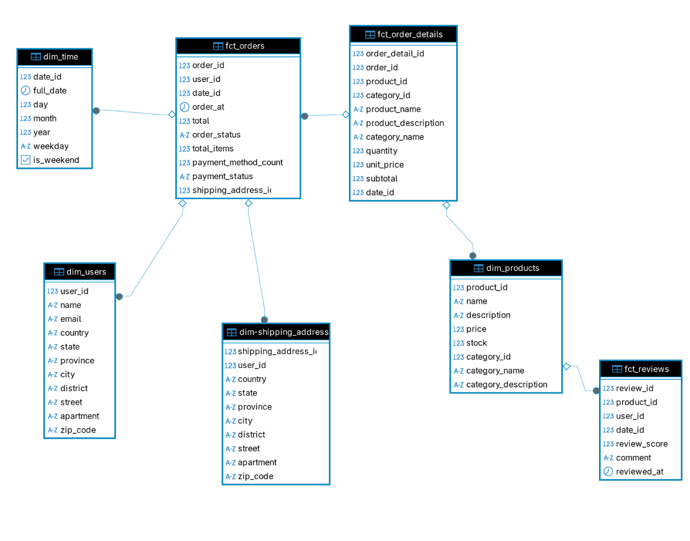

# 1-  Análisis de negocio y descubrimiento de requisitos
 
Analizar las preguntas de negocio a la luz de los datos presentados en el punto anterior.
Entender qué quiere resolver el negocio y qué datos están disponibles para ello.

## Que busca resolver el negocio?
El negocio quiere explotar su información para tomar mejores decisiones comerciales, como por ejemplo:
- Aumentar ingresos priorizando categorías con alto rendimiento.
- Detectar cuellos de botella en pagos.
- Conocer a sus mejores usuarios y premiarlos.
- Ajustar stock y pricing para productos con bajo rendimiento.
- Identificar campañas por día de la semana o mes con mejor ROI.
- Que datos estan no disponibles?
```
Tabla metodos de pago vacia. Lo cual nos termina dejando sin visibilidad a metricas como:
- ¿Cuáles son los métodos de pago más utilizados?
- ¿Cuál es el monto promedio pagado por método de pago?
- ¿Cuántas órdenes se pagaron usando más de un método de pago?
```
```
No disponemos de una tabla de altas lo cual no nos permite responder a:
- ¿Cuántos usuarios se registran por mes?
```

#### Tenemos la mayoria de datos necesarios en el modelo actual para responder a las preguntas de negocio.

#### El modelo actual está en formato OLTP (transaccional). Es necesario transformarlo en un modelo dimensional (OLAP) con:
- Tablas de hechos.
- Tablas dimensionales (producto, tiempo, cliente, etc.).
- Posiblemente, SCD para atributos cambiantes (como dirección del cliente o nombre del producto).

# 2- Identificación de componentes del modelo dimensional

### Hechos
Las tablas de hechos representan eventos medibles del negocio, generalmente transacciones u operaciones cuantificables. En este caso, los hechos principales se relacionan con:

- Órdenes de compra: cantidad total de productos por orden, monto total pagado, fecha, etc.
- Detalle de órdenes: cantidad de unidades vendidas por producto, precio unitario, subtotal por ítem.
- Reseñas: calificación otorgada por el usuario a un producto.

Estas tablas permitirán realizar análisis relacionados con volumen de ventas, ingresos, comportamiento de pago y percepción de calidad.


### Dimensiones
Las tablas dimensionales brindan el contexto necesario para segmentar, filtrar y agrupar las métricas contenidas en las tablas de hechos. Se definieron las siguientes dimensiones:

- Producto: incluye atributos como nombre, categoría, subcategoría, precio y stock.
- Usuario: datos identificatorios y demográficos básicos del cliente.
- Tiempo: dimensión clave para analizar variaciones por fecha, mes, año o día de la semana. 
- Método de pago: representa el medio utilizado (aunque los datos originales están incompletos, puede inferirsedesde - las relaciones de pago).
- Categoría/Subcategoría: jerarquía del catálogo de productos.
- Dirección de envío: para análisis por región, ciudad o país.

Estas dimensiones se utilizarán como filtros en los dashboards y reportes del negocio, permitiendo un análisis multiangular y detallado.


## 3 Diseño del modelo de datos

### Diseño conceptual y lógico
Con base en el análisis de negocio y la identificación de hechos y dimensiones, se propuso un modelo estrella (star schema) como arquitectura principal, con una tabla de hechos central conectada a múltiples dimensiones.
Tabla de hechos principal

#### fct_orders
```
    order_id,
    user_id,
    date_id,
    order_at,
    total,
    order_status,
    total_items,
    payment_method_count,
    payment_status,
    shipping_address
```

#### fct_order_detail
```
    order_detail_id,
    order_id,
    product_id,
    category_id,
    name,
    description,
    name,
    description
    date_id,
    quantity,
    unit_price,
    subtotal,
```

#### fct_reviews
```
    review_id,
    product_id,
    user_id,
    date_id,
    review_score,
    comment,
    reviewed_at,
```


#### dim_products
```
  surrogate_key,
  product_id,
  name,
  description,
  price,
  stock,
  category_id,
  valid_from,
  valid_to,
  is_current
```

#### dim_users
```
    user_id,
    name,
    email,
    country,
    state,
    province,
    city,
    district,
    street,
    apartment,
    zip_code
```

#### dim_time
```
    date_id,
    full_date,
    day,
    month,
    year,
    weekday,
    is_weekend
```


#### dim_shipping_address
```
shipping_address_id,
user_id,
country,
state,
province,
city,
district,
street,
apartment,
zip_code
```


### Slowly Changing Dimensions (SCDs)> Implementación práctica

Se evaluaron los atributos de cada dimensión para decidir la estrategia de SCD más adecuada.
En dim_productos se puede aplicar SCD Tipo 2 si se requiere trazar la evolución de precios.


## 4 Documentación y comunicación del modelo

### Objetivo del modelo

El modelo dimensional fue diseñado para permitir el análisis eficiente de la información relacionada con ventas, usuarios, productos y pagos. Su estructura facilita la exploración por múltiples dimensiones del negocio, como el tiempo, los clientes, las categorías de productos o los métodos de pago, de forma rápida y flexible.

### Justificación del diseño

- Se separaron las órdenes (hechos_ordenes) del detalle por producto (detalle_ordenes) para permitir análisis adistinto nivel de granularidad sin redundancia de datos.
- Se utilizaron dimensiones con claves sustitutas para facilitar futuras estrategias de historización.
- Se introdujeron dimensiones auxiliares como dim_tiempo para enriquecer el análisis coninformación temporal.
- Se anticipó la necesidad de manejar dimensiones lentamente cambiantes (SCDs) para productos. (producs_price_snapshot.sql)


